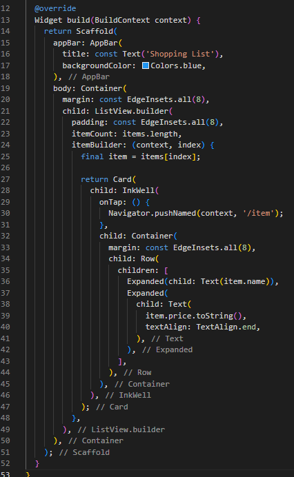
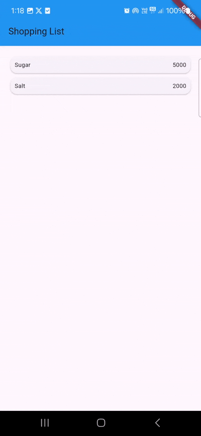

# Laporan Praktikum #06 | Layout dan Navigasi

## Identitas Mahasiswa

| Atribut | Nilai                       |
| ------- | --------------------------- |
| Nama    | Revalina Kristanti Putri    |
| NIM     | 244107060093                |
| Kelas   | SIB-2D                      |

---

---

# Tugas Praktikum 1

## Soal 1

Selesaikan Praktikum 1 sampai 4, lalu dokumentasikan dan push ke repository Anda berupa screenshot setiap hasil pekerjaan beserta penjelasannya di file README.md!

### PRAKTIKUM 1: Membangun Layout di Flutter

**Langkah 2**


**Langkah 4**

- Soal 1


- Soal 2


- Soal 3


- Output


### PRAKTIKUM 2: Implementasi button row

**Langkah 1**


**Langkah 2**


- Output


### PRAKTIKUM 3: Implementasi text section

**Langkah 1**


- Output


### PRAKTIKUM 4: Implementasi image section

- Output


## Soal 2

Silakan implementasikan di project baru "basic_layout_flutter" dengan mengakses sumber ini: https://docs.flutter.dev/codelabs/layout-basics

**Menambahkan rekomendasi section**

```dart
Widget recommendationSection = Container(
    padding: const EdgeInsets.all(16),
    child: Column(
      crossAxisAlignment: CrossAxisAlignment.start,
      children: [
        const Text(
          'Rekomendasi Gunung Lain',
            style: TextStyle(fontSize: 20, fontWeight: FontWeight.bold),
          ),
          const SizedBox(height: 16),
          Row(
            crossAxisAlignment: CrossAxisAlignment.center,
            children: [
              Expanded(
                child: Container(
                  height: 120,
                  decoration: BoxDecoration(
                    borderRadius: BorderRadius.circular(8),
                  ),
                  child: ClipRRect(
                    borderRadius: BorderRadius.circular(8),
                    child: Image.asset('images/Gunung_bokong.jpeg', fit: BoxFit.cover),
                  ),
                ),
              ),
              const SizedBox(width: 8),
              Expanded(
                child: Container(
                  height: 120,
                  decoration: BoxDecoration(
                    borderRadius: BorderRadius.circular(8),
                  ),
                  child: ClipRRect(
                    borderRadius: BorderRadius.circular(8),
                    child: Image.asset('images/Gunung_buthak.jpg', fit: BoxFit.cover),
                  ),
                ),
              ),
              const SizedBox(width: 8),
              Expanded(
                child: Container(
                  height: 120,
                  decoration: BoxDecoration(
                    borderRadius: BorderRadius.circular(8),
                  ),
                  child: ClipRRect(
                    borderRadius: BorderRadius.circular(8),
                    child: Image.asset('images/Gunung_budugasu.jpeg', fit: BoxFit.cover),
                  ),
                ),
              ),
            ],
          ),
        ],
      ),
    );
```

**Tambahkan juga di body**


**Output**


## Soal 3

Kumpulkan link commit repository GitHub Anda kepada dosen yang telah disepakati!

# Praktikum 5: Membangun Navigasi di Flutter

- Langkah 1: Siapkan project baru


- Langkah 2: Mendefinisikan Route


- Langkah 3: Lengkapi Kode di main.dart


- Langkah 4: Membuat data model


- Langkah 5: Lengkapi kode di class HomePage


- Langkah 6: Membuat ListView dan itemBuilder


- Langkah 7: Menambahkan aksi pada ListView



